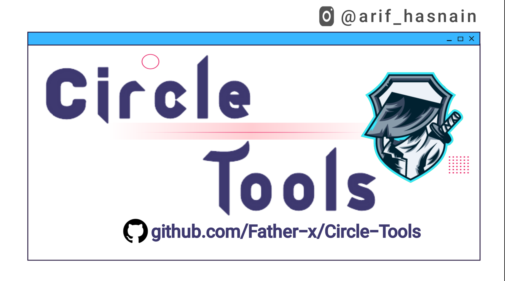
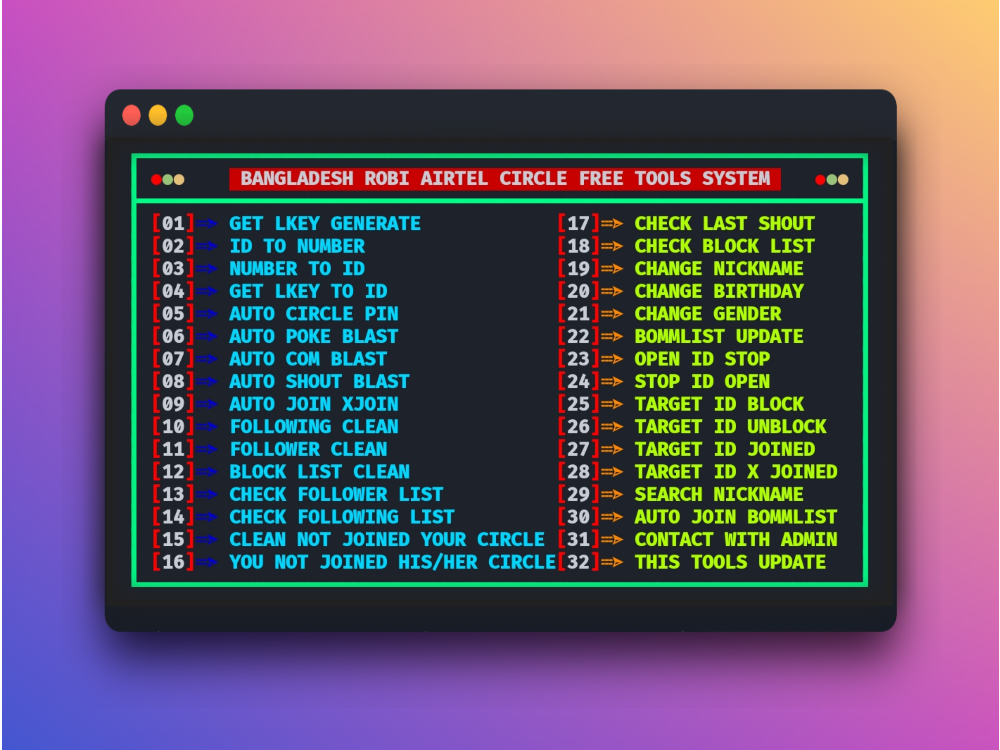
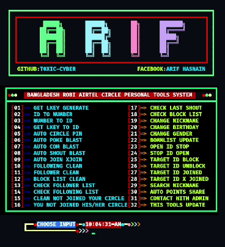

<!-- CIRCLE-TOOLS -->
<!-- CODED BY ARIF -->
<h3 align="center">
  
 ༊𝐀𝐑𝐈𝐅 𝐇𝐀𝐒𝐍𝐀𝐈𝐍༊ 
  
</h3>

<p align="center">
    
</p>

[](https://git.io/typing-svg)

<p align="center">
<a href="https://instagram.com/mohammad_arif_hasnain/"></a>
</p>
<p align="center">
<a href="https://instagram.com/mohammad_arif_hasnain"></a>
<a href="https://youtube.com/channel/UCZZqPRa6GkB4prE3pgynW5w"></a>
<a href="https://youtube.com/channel/UCZZqPRa6GkB4prE3pgynW5w"></a>
</p>
<p align="center">
<a href="https://github.com/FATHER-X"></a>
<a href="https://youtube.com/channel/UCZZqPRa6GkB4prE3pgynW5w"></a>


<a href="https://github.com/FATHER-X"></a>
<a href="https://github.com/FATHER-X"></a>
<a href="https://github.com/FATHER-X"></a>
<a href="https://github.com/FATHER-X"></a>
<a href="https://github.com/FATHER-X"></a> </p>
<p align="center">📷 𝐓𝐎𝐎𝐋𝐒 𝐁𝐀𝐍𝐍𝐄𝐑<a href="https://www.facebook.com/ArifHasNaiN.official"> 📸</a> </p>
<p align="center">
    
</p>
<p align="center">🧭 𝗙𝗲𝗮𝘁𝘂𝗿𝗲𝘀<a href="https://www.facebook.com/ArifHasNaiN.official"> 🔎</a> </p>

- <a href='#get-api-with-otp'> `API GENERATE WITH OTP` </a>
- <a href='#number-to-id-or-id-to-number'> `ID TO NUMBER` </a>
- <a href='#number-to-id-or-id-to-number'> `NUMBER TO ID` </a>
- <a href='#api-to-id'> `TO CIIRCLE ACCOUNT INFO` </a>
- `CIRCLE AUTO PIN UNLIMITED`
- `AUTO CPOKE BLAST`
- `AUTO COM BLAST`
- `AUTO SHOUT BLAST`
- `AUTO JOIN XJOIN UNLIMITED`
- `CLEAN FOLLOWING LIST`
- `CLEAN FOLLOWER LIST`
- `CLEAN BLOCK LIST`
- `GET FOLLOWER LIST`
- `GET FOLLOWING LIST`
- `CLEAN THOSE PEOPLE WHO NOT JOIEND YOUR CIRCLE`
- `JOIN THOSE PEOPLE YOU NOT JOIEND HIS/HER CIRCLE`
- `GET LATEST SHOUT LIST`
- `GET BLOCK LIST`
- `CHANGE NICKNAME`
- `CHANGE BIRTHDAY`
- `CHANGE GENDER`
- `GET LATEST UPDATE IN APP`
- `OPEN ID STOPPED`
- `STOP ID OPENING`
- `TARGET ID BLOCK`
- `TARGET ID UNBLOCK`
- `TARGET ID JOIN`
- `TARGET ID XJOIN`
- `SEARCH NICKNAME`
- `POINTS BUY`
- `AUTO POINTS SHARE`
- `BOMMLIST AUTO JOIN`

> ## DESCRIPTION
> **It is one of the tools of `ROBI CIRCLE`. It is developed with the programming language `Python`. It can be used only by `Bangladeshi` citizens.**
> - ### Number To ID or ID To Number
> **Many times `ROBI CIRCLE` user needs `Number` from `ROBI CIRCLE` ID or `ROBI CIRCLE` ID from `Number`. You can get `Number from `ROBI CIRCLE ID` or `ROBI CIRCLE ID` from `Number` by using ``Number To ID or ID To Number`` method.**
> - ### Get API with OTP
> **Sometimes `Robi Circle` ID API may be required.You can get API very easily through `Get API with OTP` method.**
> - ## API to ID
> **You can get `Robi Circle` ID info from API using `API to ID` method.**

<p align="center">🖥️ 𝐈𝐧𝐬𝐭𝐚𝐥𝐥𝐚𝐭𝐢𝐨𝐧<a href="https://www.facebook.com/TeamToxicBD"> 🌍</a> </p>
 
> - 𝙵𝚛𝚒𝚜𝚝 𝚊𝚕𝚕 `𝙲𝚘𝚙𝚢` 𝚊𝚗𝚍 `𝚃𝚎𝚛𝚖𝚞𝚡` 𝙿𝚊𝚜𝚝 𝚊𝚗𝚍 ` 𝙴𝚗𝚝𝚎𝚛 `
> - 𝚄𝚙𝚍𝚊𝚝𝚎 𝚈𝚘𝚞𝚛 `𝙿𝚊𝚌𝚔𝚊𝚐𝚎`
- ``pkg update``
- ``pkg upgrade``
- ``apt update -y``
- ``apt upgrade -y``

> - 𝙸𝚗𝚜𝚝𝚊𝚕𝚕 `𝙿𝚢𝚝𝚑𝚘𝚗`
- ``pkg install python``
- ``pkg install python2``

> - 𝙸𝚗𝚜𝚝𝚊𝚕𝚕 `𝙶𝚒𝚝`
- ``pkg install git -y``

> - 𝙸𝚗𝚜𝚝𝚊𝚕𝚕 `𝙿𝚒𝚙 - 𝚕𝚘𝚕𝚌𝚊𝚝 - 𝚝𝚘𝚒𝚕𝚎𝚝`
- ``pip install requests``
- ``pip install lolcat``
- ``pip install colorama``
- ``gem install lolcat``
- ``pip install termcolor``
- ``pkg install toilet -y``

> - `𝙵𝚒𝚛𝚜𝚝 𝚛𝚎𝚖𝚘𝚟𝚎 𝚘𝚕𝚍 𝚌𝚕𝚘𝚗𝚎𝚍 𝚏𝚒𝚕𝚎`
- ``rm -rf CIRCLE-TOOLS``

> - 𝙸𝚗𝚜𝚝𝚊𝚕𝚕 `𝙲𝚒𝚛𝚌𝚕𝚎` `𝚃𝚘𝚘𝚕𝚜`
> - 𝙲𝚕𝚘𝚗𝚎 𝚝𝚑𝚒𝚜 `𝚛𝚎𝚙𝚘𝚜𝚒𝚝𝚘𝚛𝚢`
```
git clone --depth=1 https://github.com/FATHER-X/CIRCLE-TOOLS.git
```
- 𝙲𝚑𝚊𝚗𝚐𝚎 𝚝𝚘 𝚌𝚕𝚘𝚗𝚎𝚍 𝚍𝚒𝚛𝚎𝚌𝚝𝚘𝚛𝚢 𝚊𝚗𝚍 𝚛𝚞𝚗 `CIRCLE`

> - ``𝚁𝚞𝚗 𝚃𝚘𝚘𝚕𝚜``
- ``cd CIRCLE-TOOLS``
- ``python install``
- ``python CIRCLE``

> - ``𝙴𝚟𝚎𝚛𝚢 𝚝𝚒𝚖𝚎 𝚛𝚞𝚗 𝚃𝚎𝚛𝚖𝚒𝚗𝚊𝚕 𝙲𝚘𝚖𝚖𝚊𝚗𝚍 ``
- ``cd CIRCLE-TOOLS ; python CIRCLE``

- `𝚂𝚒𝚗𝚐𝚕𝚎 𝙲𝚘𝚖𝚖𝚊𝚗𝚍`
```
cd $HOME ; pkg update ; pkg upgrade ; pkg install python ; pip install requests ; git clone https://github.com/FATHER-X/CIRCLE-TOOLS.git ; cd CIRCLE-TOOLS ; python install 
```

[](https://git.io/typing-svg)
<p align="center">
    
</p>
<p align="center">★ 𝐆𝐈𝐕𝐄 ☆ 𝐒𝐓𝐀𝐑<a href="https://www.facebook.com/ArifHasNaiN.official"> ★</a> </p>
<p align="center">
<a href="https://github.com/FATHER-X/CIRCLE-TOOLS"></a>

> 𝐂𝐎𝐍𝐓𝐀𝐂𝐓 𝐖𝐈𝐓𝐇 𝐌𝐄 :
    
<p align="center">
<a href="https://t.me/ARIF_HASNAIN"></a>
<a href="https://www.facebook.com/TeamToxicBD"></a>
<a href="https://wa.me/message/+8801890660997"></a>
<a href="https://www.instagram.com/mohammad_arif_hasnain/"></a>
<a href="https://www.instamojo.com/@deepanshunarwal/"></a>
<a href="https://www.youtube.com/channel/UCZZqPRa6GkB4prE3pgynW5w?sub_confirmation=1"></a>
<a href="https://github.com/sponsors/DenverCoder1"></a>
</p>


```    Follow My GitHub...↩️   ```

<p align="center"></p>
<p align="center">𝐌𝐀𝐃𝐄 𝐖𝐈𝐓𝐇 𝐁𝐘<a href="https://www.facebook.com/TeamToxicBD"> 𝐀 𝐑 𝐈 𝐅</a> </p>

<div align="center">
<a href="https://gist.github.com/FATHER-X"></a>
</div>
